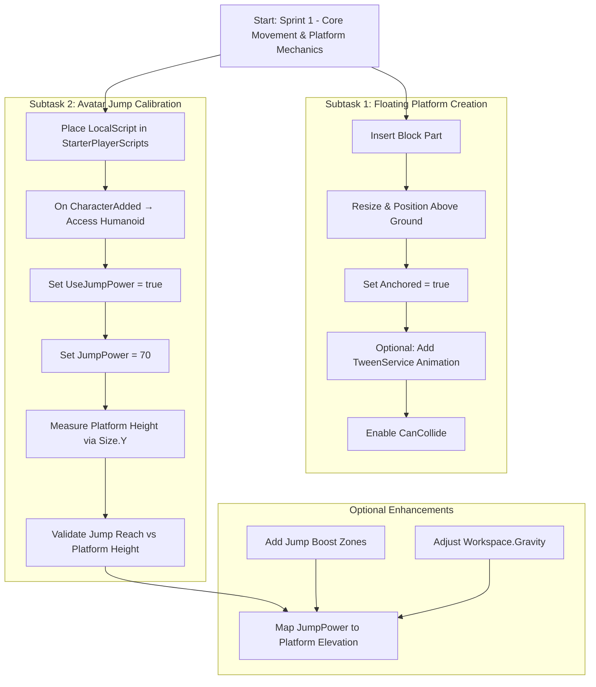

```mermaid
flowchart TD
    A[Start: Sprint 1 - Core Movement & Platform Mechanics]

    subgraph Subtask 1: Floating Platform Creation
        B1[Insert Block Part]
        B2[Resize & Position Above Ground]
        B3[Set Anchored = true]
        B4[Optional: Add TweenService Animation]
        B5[Enable CanCollide]
    end

    subgraph Subtask 2: Avatar Jump Calibration
        C1[Place LocalScript in StarterPlayerScripts]
        C2[On CharacterAdded → Access Humanoid]
        C3[Set UseJumpPower = true]
        C4[Set JumpPower = 70]
        C5[Measure Platform Height via Size.Y]
        C6[Validate Jump Reach vs Platform Height]
    end

    subgraph Optional Enhancements
        D1[Add Jump Boost Zones]
        D2[Adjust Workspace.Gravity]
        D3[Map JumpPower to Platform Elevation]
    end

    A --> B1 --> B2 --> B3 --> B4 --> B5
    A --> C1 --> C2 --> C3 --> C4 --> C5 --> C6
    C6 --> D3
    D1 --> D3
    D2 --> D3
```
